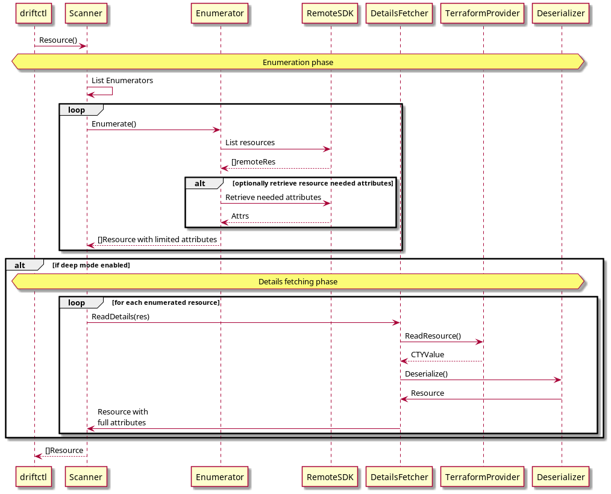

# Add new resources



## Defining the resource

First step is to implement a new resource. To do that you need to define a go struct representing all fields that need to be monitored for this kind of resource.

You can find several examples in already implemented resources like aws.S3Bucket:

```go
type AwsS3Bucket struct {
	AccelerationStatus       *string           `cty:"acceleration_status"`
	Acl                      *string           `cty:"acl" diff:"-"`
	Arn                      *string           `cty:"arn"`
	Bucket                   *string           `cty:"bucket"`
...
```

Your new type will need to implement `resource.Resource` interface in order for driftctl to retrieve its type and a unique identifier for it.

```go
type Resource interface {
	TerraformId() string
	TerraformType() string
}
```

Some resources are read differently by the terraform state reader and the supplier. You can optionally implement `resource.NormalizedResource` to add a normalization step before the comparison is made.

```go
type NormalizedResource interface {
	NormalizeForState() (Resource, error)
	NormalizeForProvider() (Resource, error)
}
```

For example S3Bucket policy is encoded in json but the formatting (newline and tabs) differs when read using the state reader. S3Bucket implements `resource.NormalizedResource`:

```go
func (s S3Bucket) NormalizeForState() (resource.Resource, error) {
	err := normalizePolicy(&s)
	return &s, err
}

func (s S3Bucket) NormalizeForProvider() (resource.Resource, error) {
	err := normalizePolicy(&s)
	return &s, err
}

func normalizePolicy(s *S3Bucket) error {
	if s.Policy.Policy != nil {
		jsonString, err := structure.NormalizeJsonString(*s.Policy.Policy)
		if err != nil {
			return err
		}
		s.Policy.Policy = &jsonString
	}
	return nil
}
```

You can implement different normalization for the state representation and the supplier one.

## Supplier and Deserializer

Then you will have to implement two interfaces:

- `resource.supplier` is used to read resources list. It will call the cloud provider SDK to get the list of resources, and
  the terraform provider to get the details for each of these resources
- `remote.CTYDeserializer` is used to transform terraform cty output into your resource

### Supplier

This is used to read resources list. It will call the cloud provider SDK to get the list of resources, and the
terraform provider to get the details for each of these resources.
You can use an already implemented resource as example.
Supplier constructor could use these arguments:

- an instance of `ParallelRunner` that you will use to parallelize your call to the supplier:

```go
results := make(map[string][]cty.Value)
for _, bucket := range response.Buckets {
    b := *bucket
    s.runner.Run(func() error {
        return s.readBucket(b, results)
    })
}
if err := s.runner.Wait(); err != nil {
    return nil, err
}
```

- an instance of `terraform.ResourceReader` that you can use to read resource using the supplier:

```go
s3Bucket, err := s.reader.ReadResource(aws.AwsS3BucketResourceType, name)
if err != nil {
    logrus.Warnf("Error reading bucket %s[%s]: %+v", name, aws.AwsS3BucketResourceType, err)
    return err
}
appendValueIntoMap(results, aws.AwsS3BucketResourceType, s3Bucket)
```

- an instance of the cloud provider SDK that you will use to retrieve resources list

### Deserializer

The deserializer is used when reading resource from the terraform provider or from the state.
The interface contains a `Deserialize(values []cty.Value) ([]resource.Resource, error)` method that you'll implement.

You should then deserialize the obtained cty values into your resource and return the list.

Example: [aws_s3_bucket_deserializer.go](https://github.com/cloudskiff/driftctl/blob/main/pkg/resource/aws/deserializer/s3_bucket_deserializer.go)

## Adding your resource

There are two files you are going to edit to make driftctl aware of your new resource.

For the state reader you will need to add your `CTYDeserializer` implementation into `iac/deserializers.go`.
Just add an instance in the list:

```go
func Deserializers() []remote.CTYDeserializer {
	return []remote.CTYDeserializer{
        aws.NewS3BucketDeserializer(),
		...
	}
}
```

Then in the cloud provider's init file (e.g. in `remote/aws/init.go`), add your new implementation for `resource.Supplier`:

```go
func Init() error {
	provider, err := NewTerraFormProvider()
	if err != nil {
		return err
	}

	terraform.AddProvider(terraform.AWS, provider)
	resource.AddSupplier(NewS3BucketSupplier(provider.Runner().SubRunner(), s3.New(provider.session)))
	...
}
```

Don't forget to add unit tests after adding a new resource.
You can also add acceptance tests if you think it makes sense.
