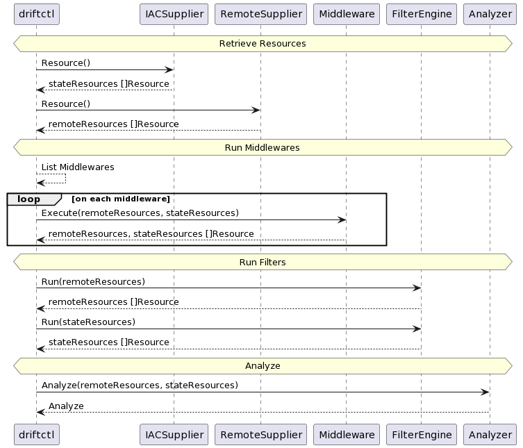
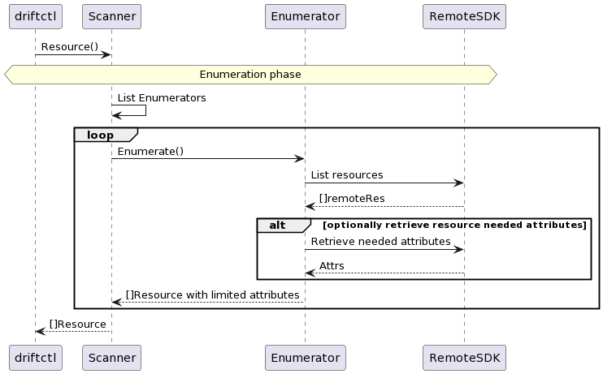

# Add new resources

First, you need to understand how `driftctl scan` works. Here you'll find a global overview of the steps that compose the scan:



Then, you'll find below a more detailed flow of how we handle the enumeration and the fetching of resource's details from the remote:



## Defining the resource

First step would be to add a file called `pkg/resource/<providername>/<resourcetype>.go`.
This file will define a string constant that will be the resource type identifier in driftctl.

For example this defines the `aws_iam_role` resource:

```go
const AwsIamRoleResourceType = "aws_iam_role"

func initAwsIAMRoleMetaData(resourceSchemaRepository resource.SchemaRepositoryInterface) {
	// force_detach_policies should not be compared so it will be removed before the comparison
	resourceSchemaRepository.SetNormalizeFunc(AwsIamRoleResourceType, func(res *resource.Resource) {
		val := res.Attrs
		val.SafeDelete([]string{"force_detach_policies"})
	})
}
```

When it's done you'll have to add this function to the metadata initialisation located in `pkg/resource/<providername>/metadatas.go`:

```go
func InitResourcesMetadata(resourceSchemaRepository resource.SchemaRepositoryInterface) {
    initAwsAmiMetaData(resourceSchemaRepository)
}
```

In order for you new resource to be supported by our terraform state reader you should add it in `pkg/resource/resource_types.go` inside the `supportedTypes` slice.

```go
var supportedTypes = map[string]struct{}{
    "aws_ami":                               {},
}
```


All resources inside driftctl are `resource.Resource` structs.
All the other attributes are represented inside a `map[string]interface`

## Repository, Enumerator

Then you will have to implement one interface:

- Repositories are the way we decided to hide direct calls to SDK and pagination logic. It's a common abstraction pattern for data retrieval.
- `remote.common.Enumerator` is used to enumerate resources. It will call the cloud provider SDK to get the list of resources.

### Repository

This will be the component that hides all the logic linked to your provider SDK. All providers have different ways to implement pagination or to name function in their API.

Here we will name all listing functions `ListAll<ResourceTypeName>`.

For AWS we decided to split repositories using the Amazon logic. So you'll find repositories for EC2, S3 and so on.
Some provider does not have this grouping logic. Keep in mind that like all our file/struct repositories should not be too big.

For our GitHub implementation the number of listing functions was not that heavy, so we created a unique repository for everything:

```go
type GithubRepository interface {
	ListRepositories() ([]string, error)
	ListTeams() ([]Team, error)
	ListMembership() ([]string, error)
	ListTeamMemberships() ([]string, error)
	ListBranchProtection() ([]string, error)
}

type githubRepository struct {
	client GithubGraphQLClient
	ctx    context.Context
	config githubConfig
	cache  cache.Cache
}

func NewGithubRepository(config githubConfig, c cache.Cache) *githubRepository {
	ctx := context.Background()
	ts := oauth2.StaticTokenSource(
		&oauth2.Token{AccessToken: config.Token},
	)
	oauthClient := oauth2.NewClient(ctx, ts)

	repo := &githubRepository{
		client: githubv4.NewClient(oauthClient),
		ctx:    context.Background(),
		config: config,
		cache:  c,
	}

	return repo
}
```

As you can see, this contains the logic to create the GitHub client (it might be created outside the repository if it makes sense to share it between multiple repositories).
driftctl, sometimes, needs to retrieve the list of resources more than once, so we cache each request to avoid unnecessary call.

### Enumerator

Enumerators can be found in `pkg/remote/<providername>/<type>_enumerator.go`. It will call the cloud provider SDK to get the list of resources.

Note that at this point, resources should not be entirely fetched and most of them will have empty attributes (e.g. only their id and type).
Most of the resource returned by enumerator have empty attributes: they only represent type and terraform id.

**There are exceptions to this**:
- Sometimes, you will need more information about resources for them to be fetched in the `DetailsFetcher`. For those cases, you will add specific attributes to the map of data.

You can use an already implemented Enumerator as example.

For example, to implement `aws_instance` resource you will need to add a `ListAllInstances()` function to `repository.EC2Repository`.

Bear in mind it will be called by the Enumerator to retrieve the list of instances.

Enumerator constructor could use these arguments:
- an instance of `Repository` that you will use to retrieve information about the resource
- the global resource factory that should always be used to create a new `resource.Resource`

Enumerator then needs to implement:
- `SupportedType() resource.ResourceType` that will return the constant you defined in the type file
- `Enumerate() ([]*resource.Resource, error)` that will return the list of resources

```go
type EC2InstanceEnumerator struct {
	repository repository.EC2Repository
	factory    resource.ResourceFactory
}

func NewEC2InstanceEnumerator(repo repository.EC2Repository, factory resource.ResourceFactory) *EC2InstanceEnumerator {
	return &EC2InstanceEnumerator{
		repository: repo,
		factory:    factory,
	}
}

func (e *EC2InstanceEnumerator) SupportedType() resource.ResourceType {
	return aws.AwsInstanceResourceType
}

func (e *EC2InstanceEnumerator) Enumerate() ([]*resource.Resource, error) {
	instances, err := e.repository.ListAllInstances()
	if err != nil {
		return nil, remoteerror.NewResourceListingError(err, string(e.SupportedType()))
	}

	results := make([]*resource.Resource, len(instances))

	for _, instance := range instances {
		results = append(
			results,
			e.factory.CreateAbstractResource(
				string(e.SupportedType()),
				*instance.InstanceId,
				map[string]interface{}{},
			),
		)
	}

	return results, err
}
```

As you can see, listing errors are treated in a particular way. Instead of failing and stopping the scan they will be handled, and an alert will be created.
So please don't forget to wrap these errors inside a `NewResourceListingError`.
For some provider error handling is not that coherent, so you might need to check in `pkg/remote/resource_enumeration_error_handler.go` and add a new case for your error.
You should test enumerator behavior when you do not have permission to enumerate resources. In the snippet above, `ListAllInstances` may return an `AccessDenied` error that should be handled.

Once the enumerator is written you have to add it to the remote initialization located in `pkg/remote/<providername>/init.go`:

```go
    remoteLibrary.AddEnumerator(NewEC2InstanceEnumerator(s3Repository, factory))
```
